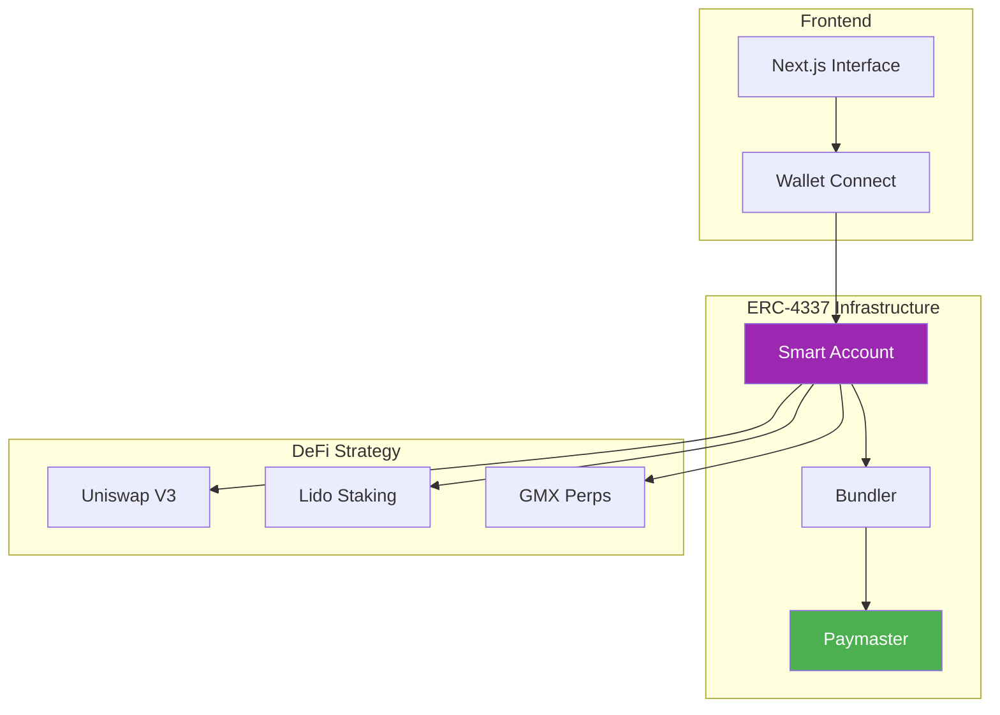

# 🎯 DeltaEase

> **One-click, gasless delta-neutral yield farming powered by ERC-4337**

[](https://sepolia.arbiscan.io/)
[](https://eips.ethereum.org/EIPS/eip-4337)

---

## 🚀 Overview

DeltaEase revolutionizes DeFi accessibility by abstracting complex financial strategies into a single, gasless interaction. We leverage **ERC-4337 Account Abstraction** to bundle multiple DeFi operations—swapping, staking, and shorting—into one atomic transaction.

**The Result:** Users earn optimized yields with zero gas fees and zero market risk exposure.

## ✨ Key Features

- **Zero Gas Fees**: Power by Alchemy's Paymaster, users never pay for gas.
- **One-Click Strategy**: Complex back-end operations (USDC → ETH → stETH + Short ETH) are handled automatically.
- **Delta Neutral**: Hedged positions ensure immunity to market volatility.
- **Non-Custodial**: Users retain full control of their funds at all times.

## 🏗️ Architecture

Our architecture integrates a polished Next.js frontend with a robust Foundry-based smart contract layer, orchestated via ERC-4337.



## 🛠️ Technology Stack

- **Frontend**: Next.js 13, React, Tailwind CSS, wagmi/viem
- **Smart Contracts**: Solidity, Foundry
- **Infrastructure**: Alchemy (Bundler & Paymaster), Arbitrum Sepolia

## 📚 Documentation

Detailed guides for developers and integrators:

- [**Development Setup Guide**](docs/development_guide.md): Get the project running locally.
- [**Alchemy Integration**](docs/alchemy_integration.md): Configure ERC-4337 Account Kit and Paymaster.

## 🚀 Quick Start

1. **Clone the repository**
   ```bash
   git clone https://github.com/groverInnovate/Trihack.git
   cd delta-neutral-vault
   yarn install
   ```

2. **Configure Environment**
   See [Development Guide](docs/development_guide.md) for detailed environment setup.

3. **Run Locally**
   ```bash
   yarn dev
   ```

## 📄 License

This project is licensed under the MIT License.

---

<div align="center">
  <strong>Built for the future of DeFi</strong>
</div>