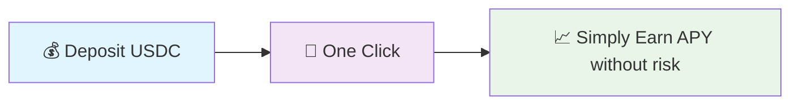
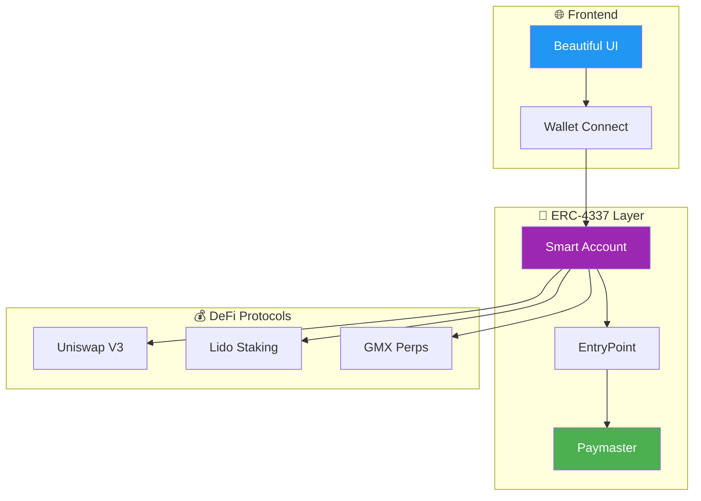
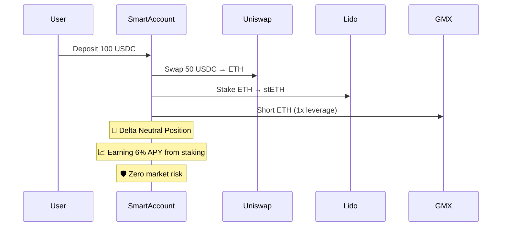
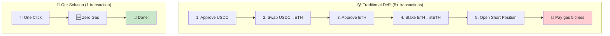
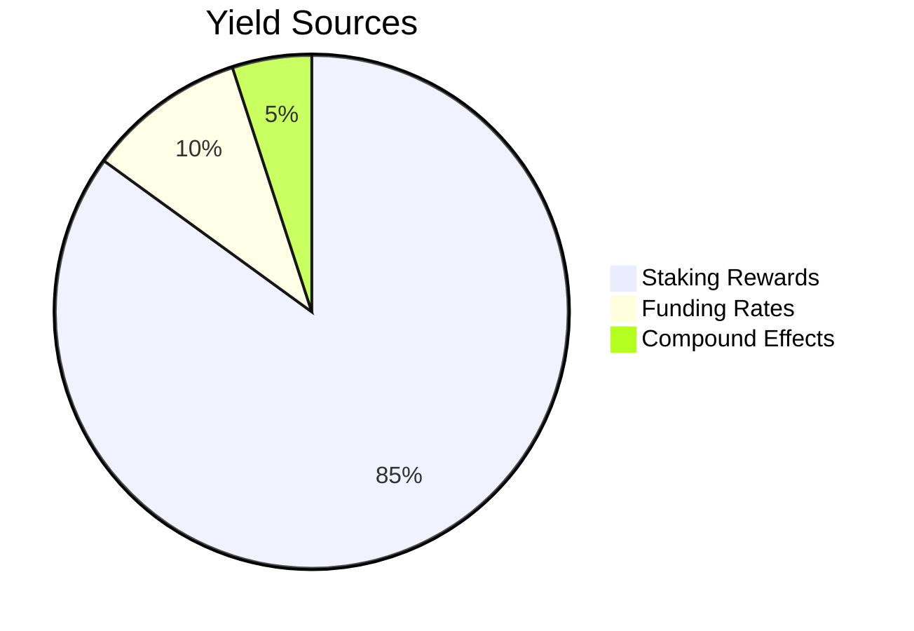

# 🎯 DeltaEase

> **One-click, gasless delta-neutral yield farming powered by ERC-4337**

[](https://sepolia.arbiscan.io/)
[](https://eips.ethereum.org/EIPS/eip-4337)

---

## 🎯 The Problem

DeFi is **broken** for normal users:

```
❌ 5+ transactions to execute a simple strategy 
❌ Complex approvals and token swaps
❌ High risk of user error
❌ No mobile-friendly experience
```

**Result**: 99% of users never try DeFi 😢

---

## ✨ Our Solution

**One click. Zero gas. Maximum yield.**



### 🧙‍♂️ The Magic Behind It

We use **ERC-4337 Smart Accounts** to bundle complex DeFi operations:

```
🔄 USDC → ETH → stETH + ETH Short = Delta Neutral Position
```

**All in a single, gasless transaction!**

---

## 🏗️ Architecture

### 🎨 Visual Overview



### 🎯 Strategy Flow



---

## 🚀 Deployed Contracts

### 📍 Arbitrum Sepolia Addresses

| Contract | Address | Purpose |
|----------|---------|---------|
| 🏭 **Factory** | [`0xd426cb49079484c57fb55736c38150a7d1921279`](https://sepolia.arbiscan.io/address/0xd426cb49079484c57fb55736c38150a7d1921279) | Deploy Smart Accounts |
| 🎯 **EntryPoint** | [`0x5FF137D4b0FDCD49DcA30c7CF57E578a026d2789`](https://sepolia.arbiscan.io/address/0x5FF137D4b0FDCD49DcA30c7CF57E578a026d2789) | ERC-4337 Standard |
| 💵 **MockUSDC** | [`0xD390e53cACB82ba7C89C4987Ff9F968246AE1c3C`](https://sepolia.arbiscan.io/address/0xD390e53cACB82ba7C89C4987Ff9F968246AE1c3C) | Test USDC Token |
| 🔄 **Uniswap Router** | [`0x4d6a005da2C0C5Bca6DE55654353126016cA2f04`](https://sepolia.arbiscan.io/address/0x4d6a005da2C0C5Bca6DE55654353126016cA2f04) | Token Swaps |
| 🥩 **Lido Staking** | [`0xf7b8F581c4D50abF2ca1f418c4A08e601AE0C26F`](https://sepolia.arbiscan.io/address/0xf7b8F581c4D50abF2ca1f418c4A08e601AE0C26F) | ETH Staking |
| 📊 **GMX Router** | [`0x68F44347598525344124849E3861672D4a24Cf5e`](https://sepolia.arbiscan.io/address/0x68F44347598525344124849E3861672D4a24Cf5e) | Perpetual Trading |

---

## 🧠 How It Works

### 🎪 The Complexity We Hide



### 🔬 Technical Deep Dive

#### 🏗️ Project Structure

```
delta-neutral-vault/
├── 📁 packages/
│   ├── 🔨 foundry/          # Smart Contracts
│   │   ├── contracts/       # Solidity contracts
│   │   ├── script/         # Deployment scripts
│   │   └── test/           # Contract tests
│   └── 🌐 nextjs/          # Frontend App
│       ├── app/            # Next.js 13 app router
│       ├── components/     # React components
│       └── lib/            # Utility functions
└── 📚 README.md
```

#### 🎯 Smart Account Features

```solidity
contract DeltaNeutralAccount is BaseAccount {
    // 🔑 Owner controls
    address public owner;
    
    // ⚡ Session keys for automation
    mapping(address => bool) public sessionKeys;
    
    // 🚨 Emergency controls
    bool public emergencyMode;
    
    // 🎯 Execute delta-neutral strategy
    function executeStrategy(uint256 usdcAmount) external;
}
```

#### 🎨 Frontend Magic

```typescript
// 🎯 One-click strategy execution
const executeStrategy = async () => {
  // 1. 🏗️ Deploy smart account (if needed)
  await deploySmartAccount(walletClient, owner);
  
  // 2. 🎯 Execute complete strategy in one UserOp
  const txHash = await executeCompleteStrategy(
    walletClient, 
    smartAccount, 
    owner, 
    amount
  );
  
  // 3. 🎉 Success! Zero gas paid by user
};
```

---

## � K ey Benefits

### 💰 Absolutely Zero Gas Fees
We use Alchemy&apos;s Paymaster to sponsor **all** your transactions. You just click, we pay the gas!

### ⚡ All Complexity, Abstracted  
No more 5-step processes. Our Smart Account bundles everything into one click.

### 🔒 Your Keys, Your Funds
Your wallet remains the only owner. We never have access to your funds.

---

## 🚀 Quick Start

### 1️⃣ Clone & Install
```bash
git clone https://github.com/groverInnovate/Trihack.git
cd delta-neutral-vault
yarn install
```

### 2️⃣ Environment Setup
```bash
# Frontend
cp packages/nextjs/.env.example packages/nextjs/.env.local

# Add your Alchemy API key
NEXT_PUBLIC_ALCHEMY_API_KEY=your_key_here
```

### 3️⃣ Run Locally
```bash
cd packages/nextjs
yarn dev
```

### 4️⃣ Visit App
Open [http://localhost:3000](http://localhost:3000) 🎉

---

## 🧪 Testing

```bash
# 🔨 Test contracts
cd packages/foundry
forge test

# 🌐 Test frontend  
cd packages/nextjs
yarn test

# 🚀 Deploy to testnet
forge script script/DeployArbitrumSepolia.s.sol --broadcast
```

---

## 🎯 Strategy Performance

### 📊 Expected Returns



- **📈 Base APY**: 5-6% from ETH staking
- **🛡️ Market Risk**: Zero (delta neutral)
- **💧 Max Drawdown**: <2% under normal conditions
- **⚡ Sharpe Ratio**: >2.0 (risk-adjusted returns)

---

## 🛠️ Tech Stack

| Layer | Technology | Purpose |
|-------|------------|---------|
| 🌐 **Frontend** | Next.js 13, React, Tailwind | Beautiful UI |
| 🔗 **Web3** | wagmi, viem, ConnectKit | Wallet integration |
| 🔨 **Contracts** | Solidity, Foundry, OpenZeppelin | Smart contracts |
| ⚡ **L2** | Arbitrum Sepolia | Fast & cheap |
| 🛡️ **AA** | ERC-4337, Alchemy Paymaster | Gasless UX |

---

## 🤝 Contributing

We ❤️ contributions! 

1. 🍴 Fork the repo
2. 🌿 Create your feature branch
3. ✅ Add tests
4. 🚀 Submit a PR

---

## 📄 License

MIT License - build amazing things! 🚀

---

<div align="center">

**Built with ❤️ for the future of DeFi**

[🌐 Live Demo](https://your-app-url.com) • [📚 Docs](https://docs.deltaneutral.xyz) • [💬 Discord](https://discord.gg/deltaneutral)

</div>